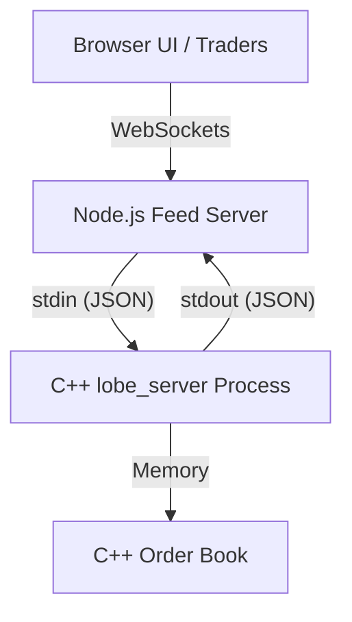

# LOBE (Low-latency Order Book Engine)

LOBE is a high-performance, price-time priority limit order book and matching engine written in modern C++. It is engineered to process market and limit orders with sub-microsecond latency, accompanied by an asynchronous Node.js/TypeScript bridge that broadcasts real-time market data via WebSockets.

Designed with systems-level performance in mind, LOBE demonstrates the core infrastructure components used in High-Frequency Trading (HFT) and quantitative finance environments.

## 🚀 Key Features & Optimizations
- **Deterministic Integer Math:** Prices are stored as 64-bit integer "ticks" rather than floating-point decimals to guarantee exact matching and prevent float rounding errors.
- **Optimized Data Structures:** Uses a combination of `std::map` for O(log N) price level discovery, `std::deque` for O(1) FIFO matching, and `std::unordered_map` for O(1) fast order cancellations.
- **Zero-Dependency IPC:** The C++ engine communicates with the networking layer via an asynchronous standard I/O pipe using newline-delimited JSON, bypassing network stack overhead between the core and the bridge.
- **Latency Benchmarking:** Includes a high-precision benchmark harness to measure nanosecond-level latency percentiles across market scenarios.

---

## 🏗️ System Architecture

The project is structured into three distinct boundaries to separate the raw mathematical execution from the slower I/O and networking layers.



### 1. Core Engine (C++)

The critical path. Operates single-threaded to avoid mutex contention. Processes orders, handles partial fills, executes trades, and maintains the order book state.

### 2. IPC & Feed Server (Node.js / TypeScript)

Acts as the distribution layer. It spawns the compiled C++ binary as a child process and acts as a bidirectional translation bridge, accepting WebSocket inputs from clients, passing them to the engine via stdin, and broadcasting stdout engine events (trades, book updates) to all connected clients.

### 3. Visualization UI (HTML/JS)

A lightweight web client used strictly to visualize the depth of the book, the spread, and the real-time tape (trade history).

---

⚙️ Core Mechanics & Flow

#### Matching Rules (Price-Time Priority)
- Price: Better prices are executed first (highest bid, lowest ask).
- Time: If multiple orders rest at the same price level, the earliest submitted order is executed first (FIFO).
- Execution Price: Trades are always executed at the resting maker's price, never the incoming taker's price.

#### Order Lifecycle
- **Limit Orders:** If crossable liquidity exists, the order acts as an aggressor (taker) and matches immediately. Any unfilled quantity rests in the book as liquidity (maker).
- **Market Orders:** Fill immediately against the best available price. Unfilled quantity is discarded (does not rest).
- **Cancellations:** Orders are indexed by `OrderId` in an unordered map, allowing immediate O(1) removal without scanning price levels.

---

## 🔌 API & Communication Protocol

The engine expects and emits newline-delimited JSON over stdin/stdout. The Node feed server exposes a WebSocket on `ws://localhost:8080` for browser clients.

### Inbound Commands (To Engine)
| Action | Example JSON Payload |
|---|---|
| Limit Buy | {"action":"buy", "price": 102.50, "qty": 100} |
| Limit Sell | {"action":"sell", "price": 103.00, "qty": 50} |
| Market Buy | {"action":"mbuy", "qty": 100} |
| Market Sell | {"action":"msell", "qty": 100} |
| Cancel | {"action":"cancel", "id": 5} |

### Outbound Events (From Engine)
- Trade Execution: `{"type":"trade", "trade_id":1, "price":102.50, "qty":50, "buy_order_id":4, "sell_order_id":2}`
- Book Snapshot (Top 5): `{"type":"book", "bids":[[102.50,100]], "asks":[[103.00,50]]}`
- Order Acknowledgement: `{"type":"ack", "id":6}`

---

## 📊 Benchmarking & Performance

Performance is tracked using the included `lobe_bench` suite, which simulates hundreds of thousands of operations to measure true latency distributions.

Scenarios tested:
- Insert-only (No Match)
- Match-heavy (every order crosses)
- Realistic Mix (70% inserts, 20% cancels, 10% market)

To run the benchmark suite and generate the latency charts:

```bash
cd build
./lobe_bench
python3 ../benchmark/report.py latency_results.csv
```

This will produce `latency_results.csv` and a visual report image (e.g. `latency_report.png`).


---

## 💻 Getting Started

### Prerequisites
- Linux/macOS (or WSL2 on Windows)
- C++17 compatible compiler (g++ or clang)
- CMake (>= 3.16)
- Node.js (>= 18.x) & npm

### Build & Run (One-Click Start)
The project includes a master script that compiles the C++ engine, installs Node dependencies, and boots the live server stack.

```bash
# 1. Clone the repository
git clone https://github.com/CodeCenturian/LOBE.git
cd LOBE

# 2. Make the script executable
chmod +x start.sh

# 3. Build and launch the full stack
./start.sh
```

Once running, the UI will be available at `http://localhost:8080` and will stream orders directly to the C++ core.

### Running the Interactive CLI (Headless Mode)
If you wish to test the C++ matching engine in a standalone terminal mode without Node.js or WebSocket:

```bash
cd build
./lobe
```

This drops you into a REPL where you can type commands like `buy 100.50 10` and `book` directly into stdin.

---

## 📂 Repository Structure

```
├── CMakeLists.txt         # C++ build configuration
├── start.sh               # Full-stack execution script
├── include/               # C++ Headers
│   ├── types.h            # Memory layouts and integer price mechanics
│   └── order_book.h       # Engine definitions and priority queues
├── src/                   # C++ Implementation
│   ├── order_book.cpp     # Core matching logic and memory management
│   ├── main.cpp           # Standalone interactive CLI wrapper
│   └── server_main.cpp    # JSON stdin/stdout bridge wrapper
├── benchmark/             # Latency measurement suite
│   ├── bench.cpp          # Hardware timer and scenario generation
│   └── report.py          # Python matplotlib graphing logic
└── feed_server/           # Network Distribution Layer
    ├── src/server.ts      # Node.js child-process spawner & WS server
    └── public/index.html  # Minimal visualization client
```

---

## 🛠️ Development Notes
- The C++ engine is designed to be as minimal and dependency-free as possible, relying solely on the C++ Standard Library for data structures and algorithms.
- The Node.js feed server is intentionally lightweight, using only built-in modules (`child_process`, `http`, `ws`) to avoid external dependencies and keep the focus on the core engine performance.
- The visualization client is a simple HTML/JS page that connects to the WebSocket feed and renders the order book and trade tape in real-time using basic DOM manipulation.
